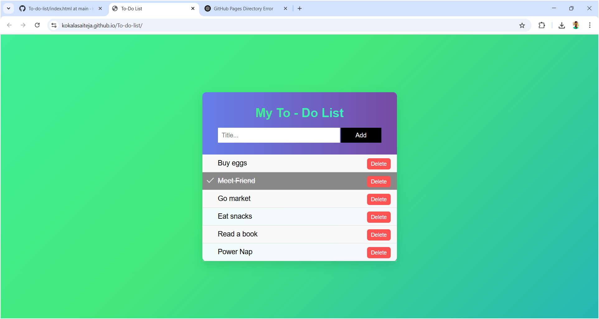

# 📝 To-Do List Web App

A simple, responsive To-Do List web app built using **HTML**, **CSS**, and **JavaScript**. Users can add, check off, and delete tasks interactively — with a sleek gradient UI and animated background.

## 🚀 Features

- Add new to-do tasks
- Mark tasks as completed
- Delete tasks individually
- Responsive and mobile-friendly layout
- Animated gradient background
- Styled using modern CSS with hover effects and transitions

## 🛠️ Technologies Used

- HTML5
- CSS3 (including gradients and animations)
- JavaScript (vanilla)

## 📂 Project Structure

index.html # Main HTML file (was to-do.html)
to-do.css # Styling for layout and elements
to-do.js # JS logic for adding, checking, deleting tasks
README.md # This file

## 🔧 Setup Instructions

1. Clone this repository:

   git clone https://github.com/Kokalasaiteja/To-do-list.git
   cd To-do-list

2. Open index.html in your browser, or deploy via GitHub Pages.

## 🌐 Live Demo

Once pushed to GitHub with the correct structure, visit:
https://kokalasaiteja.github.io/To-do-list/
Ensure that index.html, to-do.css, and to-do.js are all in the root directory of your repository.

## 📸 Screenshots

## 📌 Note
If GitHub Pages shows a 404:
Confirm index.html exists in the root folder.
Avoid using capital letters in file names (e.g., To-do.css should be to-do.css)
Wait 1–2 minutes after pushing for GitHub Pages to update.

## 📧 Author

Kokala Sai Teja
🔗 LinkedIn : 
📬 kokalasaiteja@gmail.com